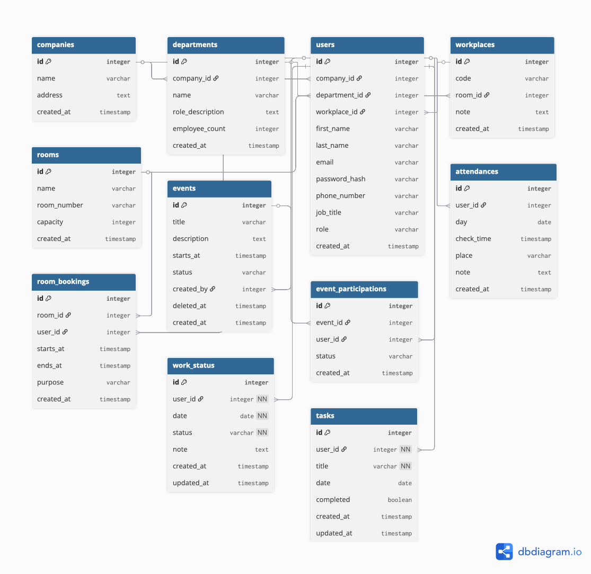

# Office Calendar Application

A modern calendar application for office management with functionalities for events, room bookings, tasks, and team management.

> **School Project** - This project was developed as part of a school assignment.

## 🌐 Live Application

The application is live and available at: **www.office-calendar.nl**

## 🔐 Login Credentials

To access the application with admin rights:

- **Email:** `1065913@hr.nl`
- **Password:** `mYgrij-jutto8-vyfpid`

> **Note:** This user has admin rights and has access to all functionalities of the application.

## 📋 Requirements

### Frontend
- Node.js (LTS version recommended)
- npm or yarn

### Backend
- .NET 9.0 SDK
- PostgreSQL database (or MySQL, depending on configuration)

## 🚀 Local Setup

### Frontend

1. Navigate to the frontend directory:
```bash
cd frontend
```

2. Install dependencies:
```bash
npm install
```

3. Start the development server:
```bash
npm run dev
```

The frontend is now available at `http://localhost:5173` (or another port as indicated in the terminal).

### Backend

1. Navigate to the backend directory:
```bash
cd backend/OfficeCalendar.Api
```

2. Make sure the database is configured in `appsettings.json`

3. Start the API:
```bash
dotnet run
```

The API is now available at `http://localhost:5000` (or as configured in `launchSettings.json`).

## 🛠️ Technology Stack

### Frontend
- React 19
- TypeScript
- Vite
- React Router
- Bootstrap & React Bootstrap
- Axios

### Backend
- .NET 9.0
- ASP.NET Core Web API
- Entity Framework Core
- PostgreSQL/MySQL
- JWT Authentication
- Dapper
- BCrypt.Net

## 📊 Database Schema (ERD)

The Entity Relationship Diagram (ERD) of the database:



## 📁 Project Structure

```
Office-calender-application/
├── frontend/          # React frontend application
│   ├── src/
│   │   ├── components/    # React components
│   │   ├── pages/         # Page components
│   │   ├── services/      # API services
│   │   └── styles/        # CSS stylesheets
│   └── package.json
│
└── backend/           # .NET backend API
    └── OfficeCalendar.Api/
        ├── Controllers/    # API controllers
        ├── Models/         # Data models
        ├── Services/       # Business logic
        ├── Repositories/   # Data access layer
        └── Infrastructure/ # Database queries
```

## 🔧 Features

- **Event Management:** Create, edit and manage events
- **Room Bookings:** Reserve and manage office spaces
- **Task Management:** Create and track tasks
- **Team Management:** Manage users, departments and companies
- **Admin Dashboard:** Full administrative control
- **Profile Management:** User profiles and settings
- **Reviews:** Review and feedback system
- **Attendance Tracking:** Track attendance at events

## 📚 School Project Information

This project was developed as part of a school assignment. It demonstrates the following skills:
- Full-stack development (React + .NET)
- Database design and implementation
- RESTful API development
- Authentication and authorization
- Modern frontend development with React and TypeScript

## 📝 License

This project was developed for educational purposes as part of a school assignment.
